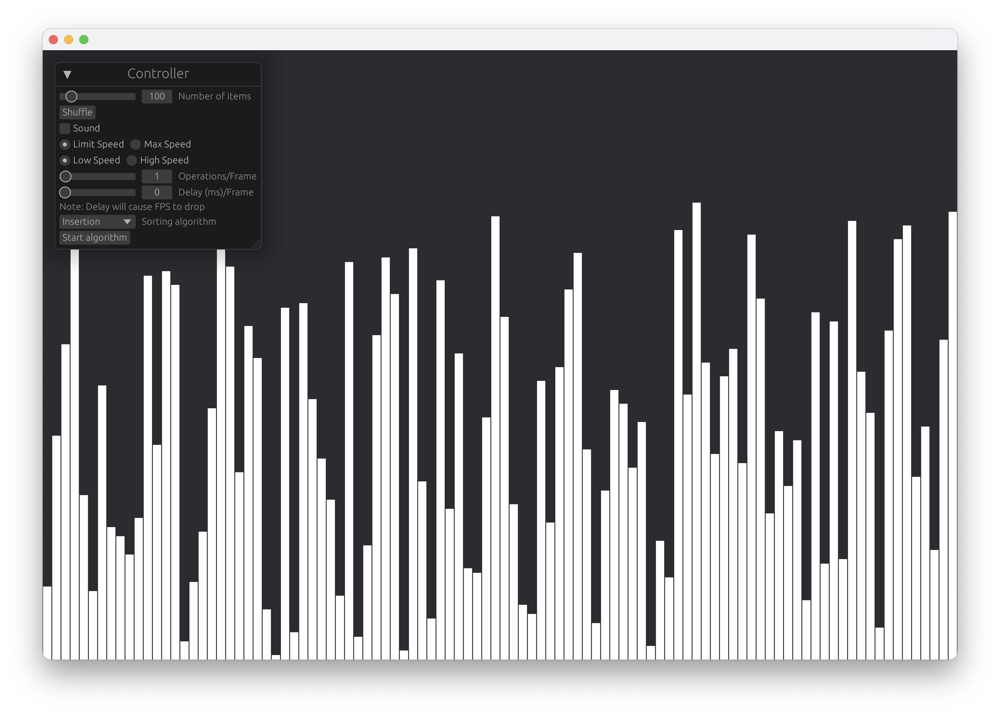
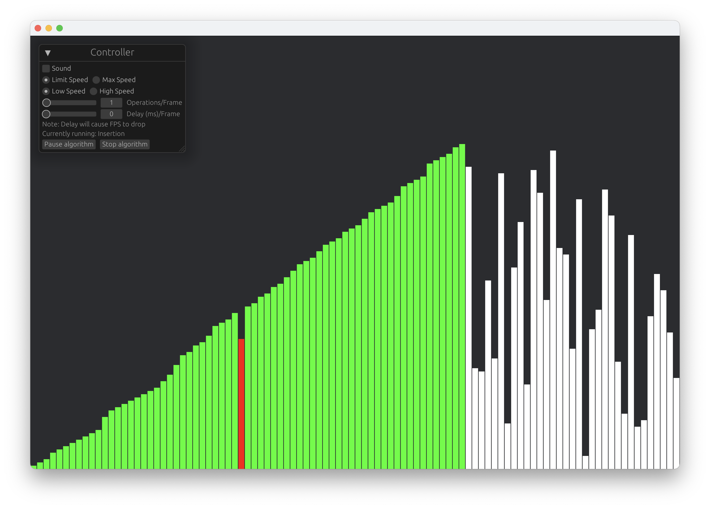
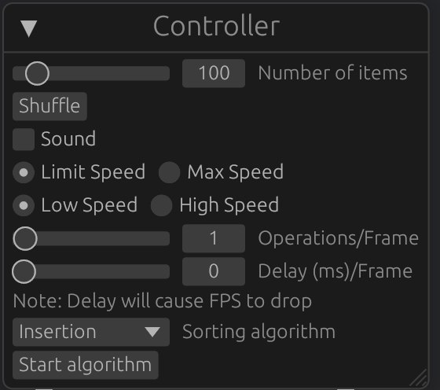

# Interactive sorting simulator





## Features

### 4 Algorithms

Insertion, Selection, Merge, Schrödinger

### Colors

Moving pointers visualized by different colors

### Interactive speed controller

The algorithms will interactivly respond to changes in speed\
Ability to Pause, Stop and Run frame by frame

### Sound

Sound generated by cubically scaled pitches related to the position of pointers

### Interactive GUI

Fully interactive GUI with a controller widget



## How to run


```zsh
cargo build --release
```
